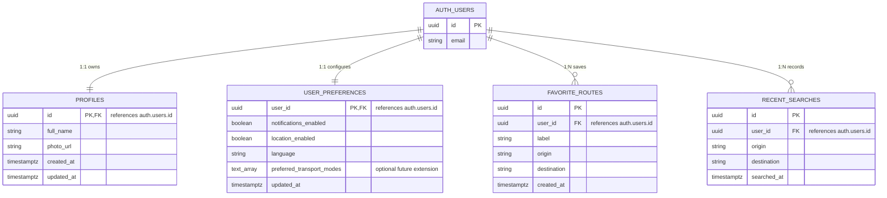

# SmartRoute Database Architecture & Schema Specifications (Planned)

This document defines the planned relational database architecture, security policies, and schema specifications for SmartRoute on **Supabase (PostgreSQL)**.

> **Phase 0 Status:** This document describes the **planned** data architecture. No database migrations are deployed during Phase 0.

---

## 1. Supabase Architectural Principles & Rules

1. **Authentication Boundary:**
   - Supabase Auth (`auth.users`) exclusively owns user authentication, credential storage, session tokens, and password validation.
   - Application-level user profile metadata and preferences belong in public application tables (`public.profiles`, `public.user_preferences`).

2. **Row Level Security (RLS) is Mandatory:**
   - Every public table must explicitly enable Row Level Security (`ALTER TABLE <table> ENABLE ROW LEVEL SECURITY;`).
   - By default, tables reject all access unless an explicit RLS policy allows it.
   - User profiles and preferences are private user-owned data: users can only access their own private records (`auth.uid() = user_id` or `auth.uid() = id`).

3. **Client-Side Key Management & Security:**
   - The Flutter mobile and web client may use the **Supabase publishable key (or legacy anon key where applicable)** together with correct Row Level Security.
   - The Supabase publishable / anon client key is not a secret, but access must always be guarded by RLS policies.
   - The Supabase **`service_role` / secret key must NEVER be bundled, committed, or exposed** in the client application.
   - Environment-specific values (e.g. Supabase URL, publishable key) should be provided through centralized configuration (e.g. Dart compile-time environment values), not duplicated across feature code.

4. **Migration-Driven Schema Management:**
   - All schema modifications (tables, indexes, RLS policies, triggers) must be versioned as SQL migration files under `supabase/migrations/`.
   - `docs/database.md` and the migration files must stay synchronized.

---

## 2. Entity Relationship Overview (Planned JC Module)

---

## 3. Schema Specifications (JC Data Ownership)

### 3.1 `public.profiles`
Stores user profile information linked directly to Supabase Auth. Profiles are private user-owned application data.

| Column | Type | Constraints | Description |
| :--- | :--- | :--- | :--- |
| `id` | `UUID` | `PRIMARY KEY`, `REFERENCES auth.users(id) ON DELETE CASCADE` | Matches Supabase Auth user ID |
| `full_name` | `TEXT` | `NOT NULL` | User's display name (required for registration & profile) |
| `photo_url` | `TEXT` | `NULL` | Optional URL to user's profile image / avatar |
| `created_at` | `TIMESTAMPTZ` | `NOT NULL DEFAULT NOW()` | Account creation timestamp |
| `updated_at` | `TIMESTAMPTZ` | `NOT NULL DEFAULT NOW()` | Last update timestamp |

**RLS Policies (Planned):**
- `SELECT`: `auth.uid() = id` (private user-owned data)
- `INSERT`: `auth.uid() = id`
- `UPDATE`: `auth.uid() = id`

---

### 3.2 `public.user_preferences`
Stores persistent user application settings and travel preferences.

> **Note on `location_enabled`:** This column stores the user's **application-level preference** indicating whether they want location-based SmartRoute features. It is NOT the authoritative Android/iOS operating system permission state; OS permission must still be requested and checked via the platform when location services are invoked.

#### Initial Required Fields:
| Column | Type | Constraints | Description |
| :--- | :--- | :--- | :--- |
| `user_id` | `UUID` | `PRIMARY KEY`, `REFERENCES auth.users(id) ON DELETE CASCADE` | Associated user ID |
| `notifications_enabled` | `BOOLEAN` | `NOT NULL DEFAULT TRUE` | In-app notification preference |
| `location_enabled` | `BOOLEAN` | `NOT NULL DEFAULT TRUE` | In-app location feature preference |
| `language` | `TEXT` | `NOT NULL DEFAULT 'en'` | Stable machine-readable language code (e.g. `'en'`, `'ms'`) |
| `updated_at` | `TIMESTAMPTZ` | `NOT NULL DEFAULT NOW()` | Last modification timestamp |

#### Optional Future Extension:
| Column | Type | Constraints | Description |
| :--- | :--- | :--- | :--- |
| `preferred_transport_modes` | `TEXT[]` | `NULL` | Optional future preference for transit mode weighting |

**Language Mapping Reference:**
- `'en'` -> English (Malaysia)
- `'ms'` -> Bahasa Melayu

**RLS Policies (Planned):**
- `SELECT`: `auth.uid() = user_id`
- `INSERT`: `auth.uid() = user_id`
- `UPDATE`: `auth.uid() = user_id`

---

### 3.3 `public.favorite_routes`
Stores saved transit journeys for quick one-tap access.

| Column | Type | Constraints | Description |
| :--- | :--- | :--- | :--- |
| `id` | `UUID` | `PRIMARY KEY DEFAULT gen_random_uuid()` | Unique favorite route ID |
| `user_id` | `UUID` | `NOT NULL`, `REFERENCES auth.users(id) ON DELETE CASCADE` | Route owner |
| `label` | `TEXT` | `NOT NULL` | User-defined label (e.g. "Home to Work") |
| `origin` | `TEXT` | `NOT NULL` | Origin station / stop identifier |
| `destination` | `TEXT` | `NOT NULL` | Destination station / stop identifier |
| `created_at` | `TIMESTAMPTZ` | `NOT NULL DEFAULT NOW()` | Creation timestamp |

**RLS Policies (Planned):**
- `ALL`: `auth.uid() = user_id` (CRUD restricted to owner)

---

### 3.4 `public.recent_searches`
Stores historical journey searches for convenient autofill on Home and Planner screens.

| Column | Type | Constraints | Description |
| :--- | :--- | :--- | :--- |
| `id` | `UUID` | `PRIMARY KEY DEFAULT gen_random_uuid()` | Unique search log ID |
| `user_id` | `UUID` | `NOT NULL`, `REFERENCES auth.users(id) ON DELETE CASCADE` | Searching user ID |
| `origin` | `TEXT` | `NOT NULL` | Origin station / stop searched |
| `destination` | `TEXT` | `NOT NULL` | Destination station / stop searched |
| `searched_at` | `TIMESTAMPTZ` | `NOT NULL DEFAULT NOW()` | Search execution timestamp |

**RLS Policies (Planned):**
- `SELECT`: `auth.uid() = user_id`
- `INSERT`: `auth.uid() = user_id`
- `DELETE`: `auth.uid() = user_id`

---

## 4. Integration Guidelines for Client Code

1. **Repository Encapsulation:**
   - Flutter controllers and UI widgets must **never** execute raw Supabase queries directly.
   - All queries must be encapsulated inside `data/datasources/` and accessed via domain repository interfaces.

2. **DTO & Domain Model Separation:**
   - Data layer classes must map raw JSON maps into strongly typed immutable domain entities before exposing them to the application layer.

3. **Offline & Error Resilience:**
   - Handle database disconnections, network timeouts, and RLS permission failures gracefully with domain-level `Failure` objects.
