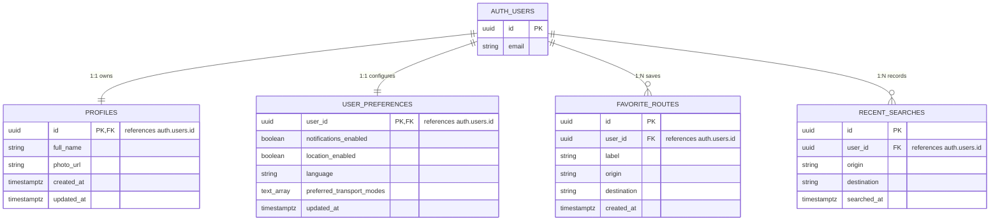

# SmartRoute Database Architecture & Schema Specifications

This document defines the relational database architecture, security policies, and planned data schemas for SmartRoute on **Supabase (PostgreSQL)**.

---

## 1. Supabase Architectural Principles & Rules

1. **Authentication Boundary:**
   - Supabase Auth (`auth.users`) exclusively owns user authentication, credential storage, session tokens, and password resets.
   - Application-level user profile metadata and preferences belong in public application tables (`public.profiles`, `public.user_preferences`).

2. **Row Level Security (RLS) is Mandatory:**
   - Every public table must explicitly enable Row Level Security (`ALTER TABLE <table> ENABLE ROW LEVEL SECURITY;`).
   - By default, tables reject all access unless an explicit RLS policy allows it.
   - Users must only be permitted to read and write their own private data (`auth.uid() = user_id`).

3. **Client-Side Key Management & Security:**
   - The Flutter mobile/web client must **ONLY** use the public `anon` (publishable) key.
   - **NEVER** commit, bundle, or expose the Supabase `service_role` key, database connection strings, or administrative secrets in the client codebase.
   - Supabase URL and anon key must be configured through environment variables / secure configuration (`core/config/`).

4. **Migration-Driven Schema Management:**
   - All schema modifications (tables, indexes, RLS policies, triggers) must be versioned as SQL migration files under `supabase/migrations/`.
   - `docs/database.md` and the actual migration files must always remain strictly synchronized.
   - **Phase 0 Notice:** Database tables are documented here for design alignment. No database migrations are deployed during Phase 0.

---

## 2. Entity Relationship Overview (JC Module)

---

## 3. Schema Specifications (JC Data Ownership)

### 3.1 `public.profiles`
Stores user profile information linked directly to Supabase Auth.

| Column | Type | Constraints | Description |
| :--- | :--- | :--- | :--- |
| `id` | `UUID` | `PRIMARY KEY`, `REFERENCES auth.users(id) ON DELETE CASCADE` | Matches Supabase Auth user ID |
| `full_name` | `TEXT` | `NULL` | User's display name |
| `photo_url` | `TEXT` | `NULL` | URL to user's profile image / avatar |
| `created_at` | `TIMESTAMPTZ` | `NOT NULL DEFAULT NOW()` | Account creation timestamp |
| `updated_at` | `TIMESTAMPTZ` | `NOT NULL DEFAULT NOW()` | Last update timestamp |

**RLS Policies (Planned):**
- `SELECT`: `auth.uid() = id` (or public read if social/sharing features are enabled)
- `INSERT`: `auth.uid() = id`
- `UPDATE`: `auth.uid() = id`

---

### 3.2 `public.user_preferences`
Stores persistent user application settings and travel preferences.

| Column | Type | Constraints | Description |
| :--- | :--- | :--- | :--- |
| `user_id` | `UUID` | `PRIMARY KEY`, `REFERENCES auth.users(id) ON DELETE CASCADE` | Associated user ID |
| `notifications_enabled` | `BOOLEAN` | `NOT NULL DEFAULT TRUE` | Push / alert notifications enabled |
| `location_enabled` | `BOOLEAN` | `NOT NULL DEFAULT TRUE` | Location access permission status |
| `language` | `TEXT` | `NOT NULL DEFAULT 'en'` | UI language code (`en`, `ms`) |
| `preferred_transport_modes` | `TEXT[]` | `NOT NULL DEFAULT '{lrt, mrt, monorail, bus, brt}'` | Preferred modes for routing |
| `updated_at` | `TIMESTAMPTZ` | `NOT NULL DEFAULT NOW()` | Last modification timestamp |

**RLS Policies (Planned):**
- `SELECT`: `auth.uid() = user_id`
- `INSERT`: `auth.uid() = user_id`
- `UPDATE`: `auth.uid() = user_id`

---

### 3.3 `public.favorite_routes`
Stores saved transit journeys for quick one-tap access.

| Column | Type | Constraints | Description |
| :--- | :--- | :--- | :--- |
| `id` | `UUID` | `PRIMARY KEY DEFAULT gen_random_uuid()` | Unique favorite route ID |
| `user_id` | `UUID` | `NOT NULL`, `REFERENCES auth.users(id) ON DELETE CASCADE` | Route owner |
| `label` | `TEXT` | `NOT NULL` | User-defined label (e.g. "Home to Work") |
| `origin` | `TEXT` | `NOT NULL` | Origin station / stop identifier |
| `destination` | `TEXT` | `NOT NULL` | Destination station / stop identifier |
| `created_at` | `TIMESTAMPTZ` | `NOT NULL DEFAULT NOW()` | Creation timestamp |

**RLS Policies (Planned):**
- `ALL`: `auth.uid() = user_id` (CRUD restricted to owner)

---

### 3.4 `public.recent_searches`
Stores historical journey searches for convenient autofill on Home and Planner screens.

| Column | Type | Constraints | Description |
| :--- | :--- | :--- | :--- |
| `id` | `UUID` | `PRIMARY KEY DEFAULT gen_random_uuid()` | Unique search log ID |
| `user_id` | `UUID` | `NOT NULL`, `REFERENCES auth.users(id) ON DELETE CASCADE` | Searching user ID |
| `origin` | `TEXT` | `NOT NULL` | Origin station / stop searched |
| `destination` | `TEXT` | `NOT NULL` | Destination station / stop searched |
| `searched_at` | `TIMESTAMPTZ` | `NOT NULL DEFAULT NOW()` | Search execution timestamp |

**RLS Policies (Planned):**
- `SELECT`: `auth.uid() = user_id`
- `INSERT`: `auth.uid() = user_id`
- `DELETE`: `auth.uid() = user_id`

---

## 4. Integration Guidelines for Client Code

1. **Repository Encapsulation:**
   - Flutter controllers and UI widgets must **never** execute raw Supabase queries directly (e.g. `Supabase.instance.client.from('profiles').select()`).
   - Queries must be encapsulated inside `lib/features/<module>/data/datasources/` and accessed via domain repository interfaces.

2. **DTO & Domain Model Separation:**
   - Data layer classes must map raw JSON maps into strongly typed immutable domain entities before exposing them to the application layer.

3. **Offline & Error Resilience:**
   - Handle database disconnections, network timeouts, and RLS permission failures gracefully with domain-level `Failure` objects.
