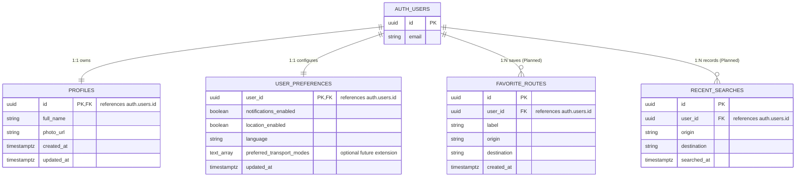

# SmartRoute Database Architecture & Schema Specifications

This document defines the relational database architecture, security policies, and schema specifications for SmartRoute on **Supabase (PostgreSQL)**.

---

## 1. Supabase Architectural Principles & Rules

1. **Authentication Boundary:**
   - Supabase Auth (`auth.users`) exclusively owns user authentication, credential storage, session tokens, and password validation.
   - Application-level user profile metadata and preferences belong in public application tables (`public.profiles`, `public.user_preferences`).

2. **Row Level Security (RLS) is Mandatory:**
   - Every public table must explicitly enable Row Level Security (`ALTER TABLE <table> ENABLE ROW LEVEL SECURITY;`).
   - By default, tables reject all access unless an explicit RLS policy allows it.
   - User profiles and preferences are private user-owned data: users can only access their own private records (`(select auth.uid()) = user_id` or `(select auth.uid()) = id`).

3. **Explicit Table Privileges & Least Privilege:**
   - Unintended client privileges are revoked from `PUBLIC`, `anon`, and `authenticated`.
   - Authenticated clients receive only `SELECT` and `UPDATE` privileges on `public.profiles` and `public.user_preferences`.
   - Direct `INSERT` and `DELETE` on user tables are disallowed for client roles because row creation is managed automatically by the database auth trigger.
   - `anon` has zero table access.
   - `service_role` is granted full table access for server-side / administrative maintenance.

4. **Private Schema & Trigger Function Security:**
   - Database trigger functions executing with `SECURITY DEFINER` reside in the non-exposed `private` schema (e.g. `private.handle_new_user()`).
   - Search path is explicitly locked (`SET search_path = ''`) with all table references schema-qualified.
   - Client execution permissions on trigger functions are revoked from `PUBLIC`, `anon`, and `authenticated`.

5. **Client-Side Key Management & Security:**
   - The Flutter mobile and web client may use the **Supabase publishable key** together with correct Row Level Security.
   - The Supabase publishable / anon client key is not a secret, but access must always be guarded by RLS policies.
   - The Supabase **`service_role` / secret key must NEVER be bundled, committed, or exposed** in the client application.
   - Environment-specific values (e.g. Supabase URL, publishable key) are provided through centralized compile-time configuration (`AppConfig.fromEnvironment()`).

6. **Migration-Driven Schema Management:**
   - All schema modifications (tables, indexes, RLS policies, triggers) must be versioned as SQL migration files under `supabase/migrations/`.
   - `docs/database.md` and the migration files must stay synchronized.

---

## 2. Entity Relationship Overview

---

## 3. Schema Specifications (JC User Management)

### 3.1 `public.profiles`
Stores user profile information linked directly to Supabase Auth. Created automatically via `private.handle_new_user()` upon auth user registration.

| Column | Type | Constraints | Description |
| :--- | :--- | :--- | :--- |
| `id` | `UUID` | `PRIMARY KEY`, `REFERENCES auth.users(id) ON DELETE CASCADE` | Matches Supabase Auth user ID |
| `full_name` | `TEXT` | `NOT NULL` | User's display name (extracted from metadata or email local-part) |
| `photo_url` | `TEXT` | `NULL` | Optional URL to user's profile image / avatar |
| `created_at` | `TIMESTAMPTZ` | `NOT NULL DEFAULT NOW()` | Account creation timestamp |
| `updated_at` | `TIMESTAMPTZ` | `NOT NULL DEFAULT NOW()` | Last update timestamp |

**Privileges & Grants:**
- `authenticated`: `SELECT`, `UPDATE`
- `service_role`: `SELECT`, `INSERT`, `UPDATE`, `DELETE`
- `anon` / `PUBLIC`: None (revoked)

**RLS Policies:**
- `SELECT`: `(select auth.uid()) = id`
- `UPDATE`: `(select auth.uid()) = id` with check `(select auth.uid()) = id`

---

### 3.2 `public.user_preferences`
Stores persistent user application settings and travel preferences. Created automatically via `private.handle_new_user()` upon auth user registration.

> **Note on `location_enabled`:** This column stores the user's **application-level preference** indicating whether they want location-based SmartRoute features. It is NOT the authoritative Android/iOS operating system permission state; OS permission must still be requested and checked via the platform when location services are invoked.

#### Fields:
| Column | Type | Constraints | Description |
| :--- | :--- | :--- | :--- |
| `user_id` | `UUID` | `PRIMARY KEY`, `REFERENCES auth.users(id) ON DELETE CASCADE` | Associated user ID |
| `notifications_enabled` | `BOOLEAN` | `NOT NULL DEFAULT TRUE` | In-app notification preference |
| `location_enabled` | `BOOLEAN` | `NOT NULL DEFAULT TRUE` | In-app location feature preference |
| `language` | `TEXT` | `NOT NULL DEFAULT 'en' CHECK (language IN ('en', 'ms'))` | Machine-readable language code |
| `updated_at` | `TIMESTAMPTZ` | `NOT NULL DEFAULT NOW()` | Last modification timestamp |

#### Language Mapping Reference:
- `'en'` -> English (Malaysia)
- `'ms'` -> Bahasa Melayu

**Privileges & Grants:**
- `authenticated`: `SELECT`, `UPDATE`
- `service_role`: `SELECT`, `INSERT`, `UPDATE`, `DELETE`
- `anon` / `PUBLIC`: None (revoked)

**RLS Policies:**
- `SELECT`: `(select auth.uid()) = user_id`
- `UPDATE`: `(select auth.uid()) = user_id` with check `(select auth.uid()) = user_id`

---

### 3.3 Database Trigger: `on_auth_user_created`
- **Schema & Name:** `private.handle_new_user()`
- **Event:** `AFTER INSERT ON auth.users FOR EACH ROW`
- **Behavior:**
  - Extracts `full_name` from metadata with email local-part and `'SmartRoute User'` fallbacks.
  - Normalizes `photo_url` metadata (null if empty or whitespace).
  - Inserts row into `public.profiles`.
  - Inserts default preferences row into `public.user_preferences`.
  - Function execution revoked from client roles (`PUBLIC`, `anon`, `authenticated`).

---

## 4. Static Transit Network & Route Data (YL)

The route planner uses public, read-only reference data seeded by
`20260828090000_create_transit_network_and_route_data.sql`:

- `public.transit_lines`: Klang Valley LRT, MRT, Monorail, KTM, BRT, and bus lines with their mode and display color.
- `public.transit_stations`: station names and coordinates used by the planner and map.
- `public.station_lines`: ordered station membership for each line and interchange markers.
- `public.transit_links`: adjacent station travel estimates and stop counts for route calculation.
- `public.route_templates`: tested origin/destination options with estimated duration, fare, and transfers.
- `public.route_template_segments`: ordered walk and transit legs for step-by-step route details.

These are static planning estimates based on the published Klang Valley network. They are not a real-time arrival or service-status source. The six tables enable `SELECT` for `anon` and `authenticated` and are writable only by `service_role`; RLS is enabled on every table.

## 5. Planned Future Tables (JC Data Ownership)

### 4.1 `public.favorite_routes` (Planned)
Stores saved transit journeys for quick one-tap access.

| Column | Type | Constraints | Description |
| :--- | :--- | :--- | :--- |
| `id` | `UUID` | `PRIMARY KEY DEFAULT gen_random_uuid()` | Unique favorite route ID |
| `user_id` | `UUID` | `NOT NULL`, `REFERENCES auth.users(id) ON DELETE CASCADE` | Route owner |
| `label` | `TEXT` | `NOT NULL` | User-defined label (e.g. "Home to Work") |
| `origin` | `TEXT` | `NOT NULL` | Origin station / stop identifier |
| `destination` | `TEXT` | `NOT NULL` | Destination station / stop identifier |
| `created_at` | `TIMESTAMPTZ` | `NOT NULL DEFAULT NOW()` | Creation timestamp |

---

### 4.2 `public.recent_searches` (Planned)
Stores historical journey searches for convenient autofill on Home and Planner screens.

| Column | Type | Constraints | Description |
| :--- | :--- | :--- | :--- |
| `id` | `UUID` | `PRIMARY KEY DEFAULT gen_random_uuid()` | Unique search log ID |
| `user_id` | `UUID` | `NOT NULL`, `REFERENCES auth.users(id) ON DELETE CASCADE` | Searching user ID |
| `origin` | `TEXT` | `NOT NULL` | Origin station / stop searched |
| `destination` | `TEXT` | `NOT NULL` | Destination station / stop searched |
| `searched_at` | `TIMESTAMPTZ` | `NOT NULL DEFAULT NOW()` | Search execution timestamp |

---

## 6. Integration Guidelines for Client Code

1. **Repository Encapsulation:**
   - Flutter controllers and UI widgets must **never** execute raw Supabase queries directly.
   - All queries must be encapsulated inside `data/` and accessed via domain repository interfaces.

2. **DTO & Domain Model Separation:**
   - Data layer classes must map raw JSON maps into strongly typed immutable domain entities before exposing them to the application layer.

3. **Offline & Error Resilience:**
   - Handle database disconnections, network timeouts, and RLS permission failures gracefully with domain-level error objects.
